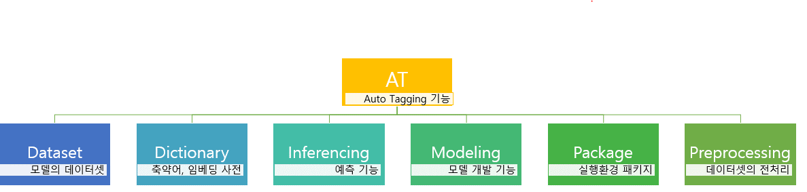

# 프로젝트 제목
ATVT(Auto_Tagging& Visualization_Tool)

## 폴더 구성 (Structure)

## 사용 방법 (Usage)
EX: 사용 방법 설명 (with 예시코드)

## Contributers
 * Ntels-BI

## 라이센스 (License)
EX : 해당하는 License (choosealicense.com 참고)

* CC0 1.0 : This project is in the public domain within the United States, and
copyright and related righcts in the work worldwide are waived through
the CC0 1.0 Universal public domain dedication. (https://creativecommons.org/publicdomain/zero/1.0/deed.ko)
