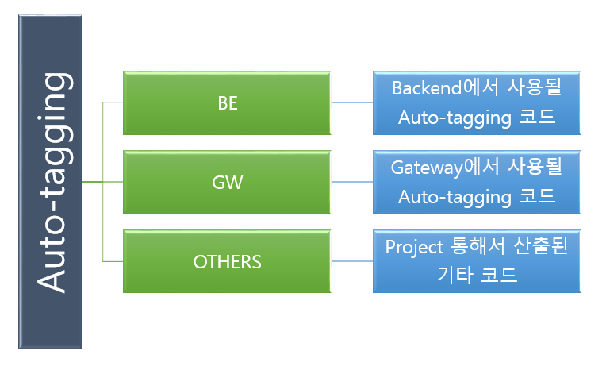

# 프로젝트 제목
ATVT(Auto_Tagging& Visualization_Tool)

## 프로젝트 설명(Description)
ATVT(Auto_Tagging& Visualization_Tool) 프로젝트를 간단히 설명하면, 자동으로 건물의 여러 장비들을 Tagging과 Visualization을 처리하는 프로젝트다.
 단계별로 보면, DDC(Direct Digital Control)에서 생성되는 정보가 BacNet이라는 프로토콜로 들어온 패킷 데이터(장비의 대략적 정보를 가지고 있음)를 바탕으로 어떤 장비인지(Project Haystack 분류 체계 사용) 유추하는 작업을 사람이 처리하는게 아니라 머신 러닝으로 자동으로 처리함으로써 시간과 자원의 효율성을 높이자는 프로젝트다.

## Project Haystack 
설명하면 건물 내부 여러 장비을 미리 정해둔 규칙으로 분류해둔 분류체계다. 건물 내의 여러 장비은 다양한 방식으로 분류가 되고, 큰 분류인 Equip level이 있고,
Equip을 더 세분화 시킨 Point level이 있다.
ATVT 프로젝트에서는 Point level을 분류하는 것으로 목적으로 하고, 체계를 그대로 사용하지 않고 Equip과 point를 '_' 을 이어 EquipName_PointName을 사용한다.

## 설치 방법 (Installation)
* git clone https://gitlab.com/ntels-atvt/auto-tagging.git

## 폴더 구성 (Structure)

#### B/E Side 폴더
* Appy.py
* Modeling.py
* Evaluating.py
* Training_airflow.py

#### G/W Side 폴더
* Inferencing_airflow.py
* App.py

#### ETC 폴더
* Label_matching.py

## 사용 방법 (Usage)
* B/E
  +  Restful Run : python ./ModelTraining/app.py
  +  Airflow Register : 
     1. export ARIFLOW_HOME=~/BE/ETC/ariflow
     2. airflow webserver
     3. airflow scheduler
     - (refer: https://airflow.apache.org/docs/stable/start.html )
  
* G/W 
  +  Restful Run : python ./ModelInferencing/app.py
  +  Airflow Register : 
     1. export ARIFLOW_HOME=~/GW/ETC/ariflow
     2. airflow webserver
     3. airflow scheduler
     - (refer: https://airflow.apache.org/docs/stable/start.html )

## Contributers
 * NTELS-AI team
 
## Referral 
 * https://ntels.sharepoint.com/sites/2019AutoTaggingVisualizationToolRD
 
## License
* Copyright @NTELS. ALL rights reserved.
